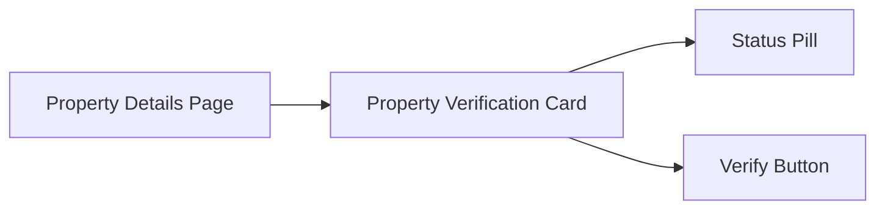

# Component Extraction Pack: Property Verification Card
## Summary
- Goal: Extract the verification card into a shared component with stable props
- Why now: Upcoming reuse in the onboarding flow needs a clean interface
- Primary outcome: Shared UI component with no direct store access

## Assumptions
- The card is currently only used in the property details page
- Verification status is provided by a feature-level store

## Scope

### In Scope
- Move card component and styles
- Replace store access with typed props
- Update current call sites

### Out of Scope
- Redesigning card visuals
- Refactoring verification API client

## Current State
- Location: client/components/PropertyVerification/PropertyCard.tsx
- Ownership: Client Portal UI
- Key dependencies:
  - verificationStore
  - api/verifyProperty
  - ui/Button
- Known pain points:
  - Tight coupling to feature store
  - Hard to reuse across flows

## Target State
- New location: shared/components/property-verification/PropertyVerificationCard.tsx
- Ownership: Shared UI
- Success criteria:
  - Props are fully typed and documented
  - No direct store or API calls inside the component

## Component Inventory

| Component | Responsibility | Inputs/Props | Outputs/Events | State | Notes |
|---|---|---|---|---|---|
| PropertyVerificationCard | Render property status and CTA | property, status, onVerify | onVerify | None (controlled) | Keep side effects outside |
| VerificationStatusPill | Show status badge | status | N/A | None | Can remain co-located |

## Extraction Plan

- Define shared props interface in shared UI package
- Move component and styles to shared folder
- Replace store selectors with props
- Add adapter wrapper in feature module
- Update existing usage to use adapter

### File and Module Moves

| From | To | Notes |
|---|---|---|
| client/components/PropertyVerification/PropertyCard.tsx | shared/components/property-verification/PropertyVerificationCard.tsx | Main component move |
| client/components/PropertyVerification/PropertyCard.module.css | shared/components/property-verification/PropertyVerificationCard.module.css | Shared styles |

### Dependency Changes

| Dependency | Change | Rationale |
|---|---|---|
| verificationStore | Remove | Shared UI should be stateless |
| api/verifyProperty | Move to caller | Side effects stay in feature layer |

## Migration Guide

### Prerequisites
- Add shared UI export barrel
- Define TypeScript types in shared package

### Step-by-Step
- Create new shared component and export
- Wrap with adapter in old location
- Update imports to use adapter
- Remove legacy store usage from component

### API Mapping

| Old API | New API | Change Type | Deprecation | Notes |
|---|---|---|---|---|
| <PropertyCard status={store.status} /> | <PropertyVerificationCard status={status} onVerify={onVerify} /> | Breaking | v2.3 | Requires adapter or new props |

### Rollout and Deprecation
- Ship adapter first
- Migrate existing call sites
- Remove legacy export in next minor release

### Testing and Verification
- Add unit tests for props mapping
- Verify status rendering states
- Mock onVerify callback

### Validation
- Smoke test property details page
- Verify analytics event still fires

### Rollback
- Revert import changes
- Restore legacy component export

## Wireframe Sketch

## Risks

| Risk | Impact | Mitigation |
|---|---|---|
| Hidden coupling to store selectors | Runtime errors in reused flows | Adapter wrapper with type guards |
| Props surface grows over time | Harder to maintain shared component | Document contract and add lint rules |

## Open Questions
- Should the adapter live in the feature or shared layer?
- Do we need a separate analytics callback prop?
