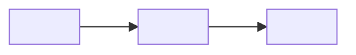

# One-Shot Component Extraction Pack (Template)

Use this outline to produce a single, dense Markdown deliverable. Replace all placeholders.

## Title

Component Extraction Pack: <ComponentName>

## Summary

- Goal: <One sentence>
- Why now: <One sentence>
- Primary outcome: <One sentence>

## Assumptions

- <Assumption 1>
- <Assumption 2>

## Scope

### In Scope

- <Item 1>
- <Item 2>

### Out of Scope

- <Item 1>

## Current State

- Location: <Repo path or module>
- Ownership: <Team or owner>
- Key dependencies: <List>
- Known pain points: <List>

## Target State

- New location: <Repo path or module>
- Ownership: <Team or owner>
- Success criteria: <Measurable outcomes>

## Component Inventory

| Component | Responsibility | Inputs/Props | Outputs/Events | State | Notes |
|---|---|---|---|---|---|
| <Component> | <Purpose> | <Inputs> | <Outputs> | <State> | <Notes> |

## Extraction Plan

1. <Step 1>
2. <Step 2>
3. <Step 3>

### File and Module Moves

| From | To | Notes |
|---|---|---|
| <Old path> | <New path> | <Reason or notes> |

### Dependency Changes

| Dependency | Change | Rationale |
|---|---|---|
| <Dep> | <Add/Remove/Move> | <Why> |

## Migration Guide

### Prerequisites

- <Requirement 1>
- <Requirement 2>

### Step-by-Step

1. <Step 1>
2. <Step 2>
3. <Step 3>

### API Mapping

| Old API | New API | Change Type | Deprecation | Notes |
|---|---|---|---|---|
| <Old> | <New> | <Breaking/Compatible> | <Date or version> | <Notes> |

### Rollout and Deprecation

- <Plan and timeline>

### Testing and Verification

- <Unit tests>
- <Integration tests>
- <Manual checks>

### Validation

- <Smoke test>
- <Metrics or monitoring>

### Rollback

- <Rollback steps>

## Wireframe Sketch

## Risks

| Risk | Impact | Mitigation |
|---|---|---|
| <Risk> | <Impact> | <Mitigation> |

## Open Questions

- <Question 1>
- <Question 2>

## Checklist

- [ ] Boundaries, inputs, outputs, and state are explicit
- [ ] Migration steps and API mapping are complete
- [ ] Rollout, validation, and rollback are covered
- [ ] Wireframe sketch included
- [ ] Risks and open questions listed
