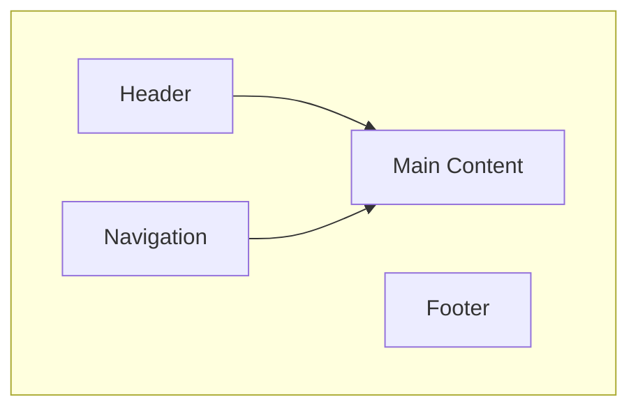
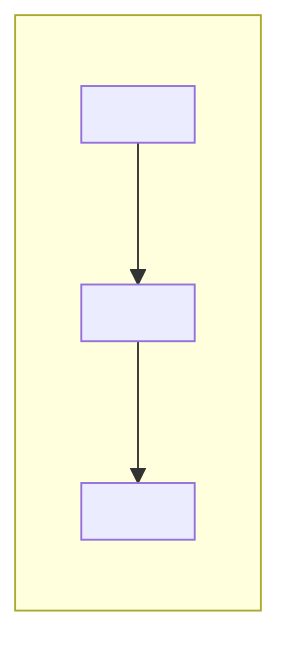

# Wireframe Diagram Patterns

Prefer Mermaid flowcharts for quick, sketch-style wireframes. Keep diagrams small and readable.

## Pattern 1: Simple Page Layout



## Pattern 2: Component Boundary Map



## ASCII Fallback (when Mermaid is not allowed)

```
+------------------------+
| Header                 |
+-----------+------------+
| Nav       | Content    |
|           |            |
+-----------+------------+
| Footer                 |
+------------------------+
```
